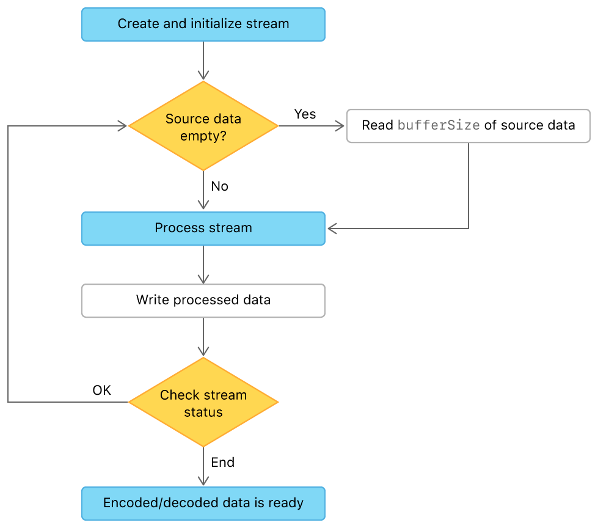

>This code derives from (is a part of) apple documentation Sample Code: [Compressing and Decompressing Files with Stream Compression](https://developer.apple.com/documentation/compression/compressing_and_decompressing_files_with_stream_compression)


# Compressing and Decompressing Files with Stream Compression

Perform compression or the appropriate kind of decompression to a file based on its path extension.

## Overview

This sample code project uses the Compression framework to encode (compress) and decode (decompress) files by dragging them to the app window. The app decompresses files with an extension that matches a supported compression algorithm (that is, `.lz4`, `.zlib`, `.lzma`, `.lz4_raw`, or `.lzfse`), and compresses all other files. The app writes the encoded or decoded result to the temporary directory returned by the [`NSTemporaryDirectory`](https://developer.apple.com/documentation/foundation/1409211-nstemporarydirectory) function.

This sample implements _stream compression_, where the app calls the encode or decode functions repeatedly to compress or decompress data from a source buffer to a destination buffer. Between calls, the app removes processed data from the source buffer and loads the new data into the destination buffer:



The advantage of this approach is that by moving the encoding or decoding to a background thread, you're able to keep your app interactive and update the user with progress of the operation (for example, with an [`NSProgressIndicato`](https://developer.apple.com/documentation/appkit/nsprogressindicator)). Stream compression also enables tasks such as:

* Decoding a compressed stream into a buffer with the ability to grow the buffer and resume decoding if the expanded stream is too large to fit, without repeating any work.
* Encoding a stream as pieces of it become available, without ever needing to create a buffer large enough to hold all the uncompressed data at one time.

## Accept Dropped Files

Register the app's view, `DragDropCompressView`, as a destination for file URLs by adding [`registerForDraggedTypes`](https://developer.apple.com/documentation/appkit/nsview/1483578-registerfordraggedtypes) to the [`viewDidMoveToSuperview`](https://developer.apple.com/documentation/appkit/nsview/1483568-viewdidmovetosuperview) method:

``` swift
override func viewDidMoveToSuperview() {
    registerForDraggedTypes([NSPasteboard.PasteboardType.fileURL])
}
```

After the user drops a conforming file onto the app, the view calls the [`performDragOperation`](https://developer.apple.com/documentation/appkit/nsdraggingdestination/1415970-performdragoperation) method. Iterate over the dragged items inside `performDragOperation`, using `guard` to ensure each item is a [`URL`](https://developer.apple.com/documentation/foundation/url) instance:

``` swift
sender.enumerateDraggingItems(options: [],
                              for: nil,
                              classes: [ NSURL.self ],
                              searchOptions: [ .urlReadingFileURLsOnly: true ]) { (draggingItem, _, _) in
    guard
        let url = draggingItem.item as? URL else {
            return
    }
```

## Select a Compression Algorithm

If speed and compression ratio are important, use [`COMPRESSION_LZFSE`](https://developer.apple.com/documentation/compression/compression_lzfse):

``` swift
let encodeAlgorithm = COMPRESSION_LZFSE
```

If you require interoperability with non-Apple devices, use [`COMPRESSION_ZLIB`](https://developer.apple.com/documentation/compression/compression_zlib) instead. For more information about other compression algorithms, see [`compression_algorithm`](https://developer.apple.com/documentation/compression/compression_algorithm).

## Distinguish Between Compressed and Uncompressed Files

Use the path extension to infer whether a file is already compressed, or if the file needs compressing. To simplify this process, create a failable initializer in an extension to the Compression framework's [`compression_algorithm`](https://developer.apple.com/documentation/compression/compression_algorithm) structure:

``` swift
init?(name: String) {
    switch name.lowercased() {
    case "lz4":
        self = COMPRESSION_LZ4
    case "zlib":
        self = COMPRESSION_ZLIB
    case "lzma":
        self = COMPRESSION_LZMA
    case "lz4_raw":
        self = COMPRESSION_LZ4_RAW
    case "lzfse":
        self = COMPRESSION_LZFSE
    default:
        return nil
    }
}
```

Use this new initializer to define the `algorithm` and `operation` constants:

``` swift
let algorithm: compression_algorithm
let operation: compression_stream_operation
                            
if let decodeAlgorithm = compression_algorithm(name: url.pathExtension) {
    algorithm = decodeAlgorithm
    operation = COMPRESSION_STREAM_DECODE
} else {
    algorithm = self.encodeAlgorithm
    operation = COMPRESSION_STREAM_ENCODE
}
```

## Define the Source and Destination File Handles

The sample uses [`FileHandle`](https://developer.apple.com/documentation/foundation/filehandle) instances to read from the source file and write to the destination file. Use optional binding to define the required file handles:

``` swift
if
    let sourceFileHandle = try? FileHandle(forReadingFrom: url),
    let sourceLength = FileHelper.fileSize(atURL: url),
    let fileName = url.pathComponents.last,
    let fileNameDeletingPathExtension = url.deletingPathExtension().pathComponents.last,
    let destinationFileHandle = FileHandle.makeFileHandle(forWritingToFileNameInTempDirectory:
        operation == COMPRESSION_STREAM_ENCODE
            ? fileName + self.encodeAlgorithm.pathExtension
            : fileNameDeletingPathExtension)
{
```

If the optional binding succeeded, the destination file handle points to the source filename with the compression algorithm appended as an extension (for compression), or the source filename with the compression name extension removed (for decopression). For example, the source file `MyCompressedFile.PDF.lzfse` would have a destination of `MyCompressedFile.PDF`, and `MyRawFile.PDF` would have a destination of `MyRawFile.PDF.lzfse`.

Pass the source and destination file handles, with the operation and algorithm values to the helper function `streamingCompression`:

``` swift
Compressor.streamingCompression(operation: operation,
                                sourceFileHandle: sourceFileHandle,
                                destinationFileHandle: destinationFileHandle,
                                algorithm: algorithm) {
                                    self.progress.completedUnitCount = $0
}
```

## Create a Destination Buffer

The `streamingCompression` method iterates over the source data, encoding or decoding data in blocks based on the length defined by `bufferSize`. The method writes the result into the destination buffer, and writes the destination buffer data to the destination file handle. The following declares the buffer size and allocates the destination buffer:

``` swift
let bufferSize = 32_768
let destinationBufferPointer = UnsafeMutablePointer<UInt8>.allocate(capacity: bufferSize)
defer {
    destinationBufferPointer.deallocate()
}
```

## Create a Compression Stream

The [`compression_stream`](https://developer.apple.com/documentation/compression/compression_stream) structure defines the source and destination pointers and sizes. To simplify the instantiation of a `compression_stream` structure, create an extension that allocates the required memory:

``` swift
extension compression_stream {
    init() {
        self = UnsafeMutablePointer<compression_stream>.allocate(capacity: 1).pointee
    }
}
```

Use the following extension to declare and initialize the compression stream:

``` swift
var stream = compression_stream()
var status = compression_stream_init(&stream, operation, algorithm)
guard status != COMPRESSION_STATUS_ERROR else {
    fatalError("Unable to initialize the compression stream.")
}
```

After you're finished with the `compression_stream` structure, it's important that you free the memory allocated to it with [`compression_stream_destroy`](https://developer.apple.com/documentation/compression/1480978-compression_stream_destroy). Use a defer block to ensure the memory is freed even if the `streamingCompression` method exits early:

``` swift
defer {
    compression_stream_destroy(&stream)
}
```

With the compression stream inialized, set up the stream by defining its source and destination sizes and destination pointer:

``` swift
stream.src_size = 0
stream.dst_ptr = destinationBufferPointer
stream.dst_size = bufferSize
```

## Read the Source File Data Iteratively

Use a `repeat-while` loop to manage the read-encode/decode-write process. If the stream's source size is zero, read a block of data from the source file handle and point the stream's source pointer to that data. If the read data is shorter than the buffer size, you can infer that you're reading the last block of the source file and set the stream's status to [`COMPRESSION_STREAM_FINALIZE`](https://developer.apple.com/documentation/compression/compression_stream_flags/compression_stream_finalize):

``` swift
var sourceData: Data?
repeat {
    var flags = Int32(0)
    
    // If this iteration has consumed all of the source data,
    // read a new tempData buffer from the input file.
    if stream.src_size == 0 {
        sourceData = sourceFileHandle.readData(ofLength: bufferSize)
        
        stream.src_size = sourceData!.count
        if sourceData!.count < bufferSize {
            flags = Int32(COMPRESSION_STREAM_FINALIZE.rawValue)
        }
    }
```

## Compress or Decompress the Dragged File

Use [`compression_stream_process`](https://developer.apple.com/documentation/compression/1480976-compression_stream_process) to encode or decode the current block:

``` swift
if let sourceData = sourceData {
    let count = sourceData.count
    sourceData.withUnsafeBytes { (bytes: UnsafePointer<UInt8>) in
        stream.src_ptr = bytes.advanced(by: count - stream.src_size)
        status = compression_stream_process(&stream, flags)
    }
}
```

On return, `destinationBufferPointer` points to the encoded or decoded data.

## Write Encoded or Decoded Data to a Destination File

Check the status returned by `compression_stream_process`, if it's either [`COMPRESSION_STATUS_OK`](https://developer.apple.com/documentation/compression/compression_status/compression_status_ok?language) or [`COMPRESSION_STATUS_END`](https://developer.apple.com/documentation/compression/compression_status_end), you can write the destination data to the destination file handler:

``` swift
switch status {
case COMPRESSION_STATUS_OK,
     COMPRESSION_STATUS_END:
    
    // Get the number of bytes put in the destination buffer. This is the difference between
    // stream.dst_size before the call (here bufferSize), and stream.dst_size after the call.
    let count = bufferSize - stream.dst_size
    
    let outputData = Data(bytesNoCopy: destinationBufferPointer,
                          count: count,
                          deallocator: .none)
    
    // Write all produced bytes to the output file.
    destinationFileHandle.write(outputData)
    
    // Reset the stream to receive the next batch of output.
    stream.dst_ptr = destinationBufferPointer
    stream.dst_size = bufferSize
```

This read-encode/decode-write loop continues while `status` equals `COMPRESSION_STATUS_OK`. 

## Close the Source and Destination Files

After you're finished with the source and destination file handles, close them with the [`closeFile`](https://developer.apple.com/documentation/foundation/filehandle/1413393-closefile) method:

``` swift
sourceFileHandle.closeFile()
destinationFileHandle.closeFile()
```
