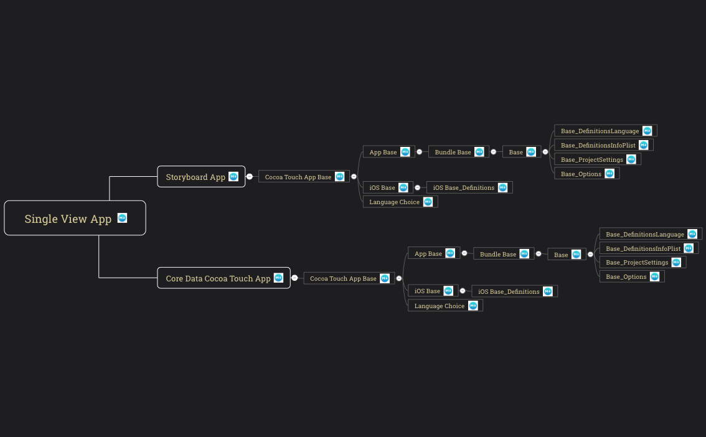

# PlistMapper
CommandLine tool to map plist files to other formats allow better analysis and improves readability

*The inspiration and main application of the tool is mapping the definition of xcode project templates (TemplateInfo.plist files) to analyze how they are built.*

### Maps to:

- [x] markdown
	- [x] xcode project template descriptions (`TemplateInfo.plist` -> **`<output>/Template Name.md`**)
		- [x] link to original TemplateInfo.plist
		- [x] link to template directory
		- [x] links to descriptions, directories and plists of all ancestors

		> Examples:  [Core Data Cocoa Touch App.md](Output/Core%20Data%20Cocoa%20Touch%20App.md), [Cocoa Touch App Base.md](Output/Cocoa%20Touch%20App%20Base.md), [**Single View App.md**](Output/Single%20View%20App.md)
	
	- [ ] other cases

		
- [x] mindmap (freemind format) - visualize inheritance of plists:
	- [x]  xcode templates inheritance mind maps
		- [x] FreeMind format (`TemplateInfo.plist` -> **`<output>/Template Name.mm`**)
		- [x] [XMind](https://www.xmind.net) format (`TemplateInfo.plist` -> **`<output>/Template Name.xmind`**)  
			xmind mind map contains links to descriptions for every template
			
		
	
	- [ ] other cases

### Arguments
- `--output <dir>`
	
	allows to provide custom output dir, default is the script directory

- `--xcode-all-proj-templates`
	
	makes the tool generate markdown files describing all known project templates
	> check argumetnts of scheme `XcodeAllTemplatesMapping` for example

- `--xcode-proj-template <template_identifier>|<template name>`
	

	makes the tool generate markdown files describing:
	
	- template defined using its identifier (TemplateInfo.plist:Identifier) or its name
	- all ancestors of the template

	and mind map file to visualise:
	
	- whole inheritance tree of selected template

	> check argumetnts of scheme `XcodeTemplateAncestorsMapping` for example

There are several schemes in xcode project, which are providing example of using arguments of the script in section `Run/Arguments` of the scheme settings

If tool is run from xcode with arguments provided in the scheme settings all files generated by sheme `XcodeTemplateAncestorsMapping` or `XcodeAllTemplatesMapping` can be found in the directory `Output` located in project directory

---
### Running on Xcode 10.2 and macOS < 10.14.4

To fire this code on Xcode 10.2 and macOS < 10.14.4 you need to install *Swift 5 Runtime Support for Command Line Tools*,
you can download it from [developer.apple.com](https://developer.apple.com/download/more/) 

### Tool Apps
On these I test and view generated files:

- [MacDown](MacDown) - markdown editor
- [XMind](https://www.xmind.net) - mind map editor. I use [XMind 8](https://www.xmind.net/xmind8-pro/), in [ZMind ZEN](https://www.xmind.net/zen/) links in generated mind map might not work.
	
	XMind is paid app, XMind 8 is expensive but available among other interesting apps through [Setapp](https://setapp.com) for reasonable price